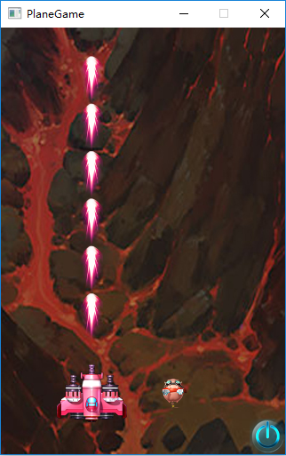
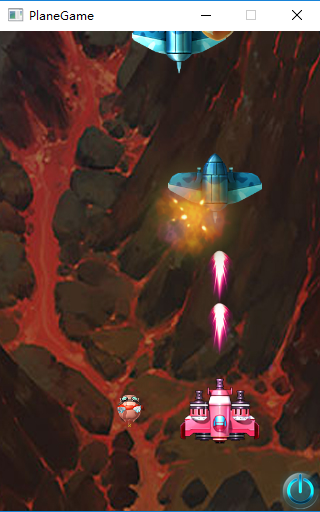

# A cocos2d-x game demo.

## Run the game  
I just run the game on pc with Visual Studio 2015, so you need your Visual Studio version greater 2015.  
**Blow is the step**
```bash
git clone https://github.com/superman-t/PlaneGame.git  
cd PlaneGame  
```
now open the **premake folder** and click the **GenerateProject.bat**.  
then will create **build Bin Lib** folder  

open the **cocos2d.sln** in **build folder** with Visual Studio.  
run PlaneGame  

## Result of the Plane Game


